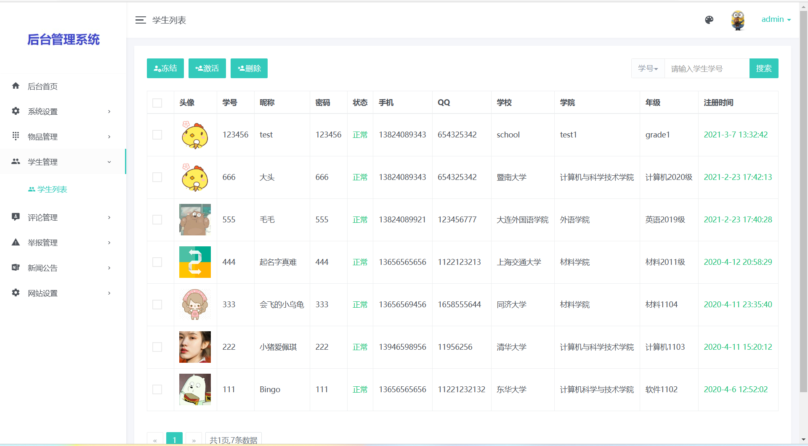
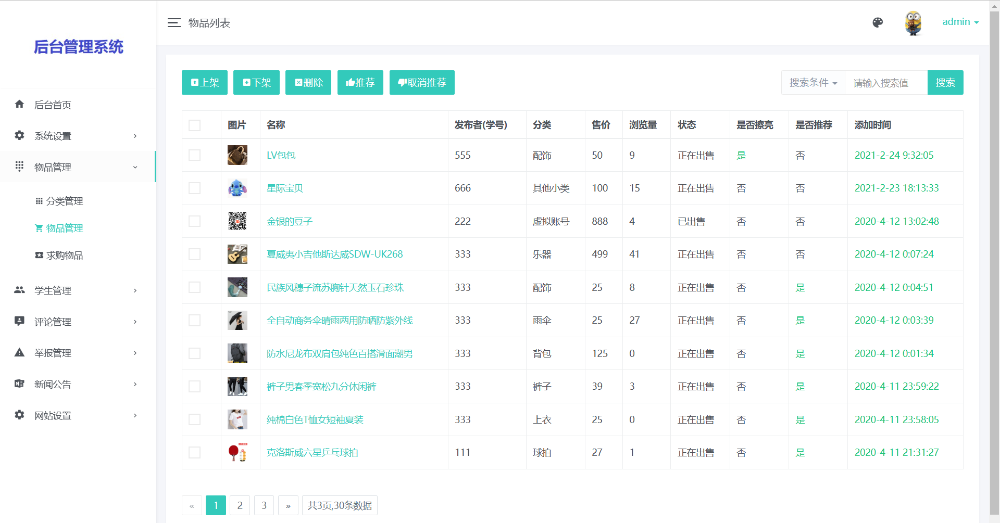
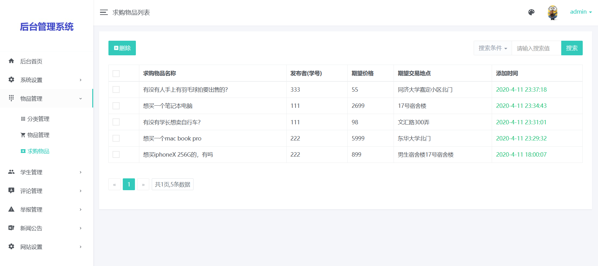
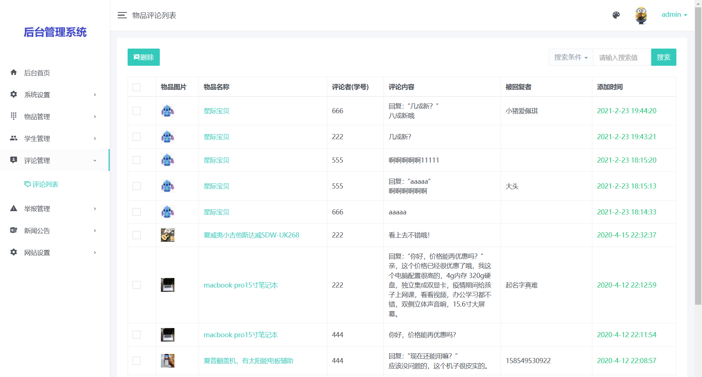
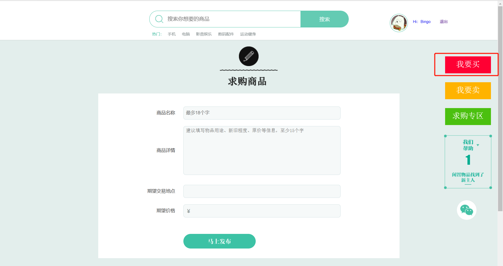
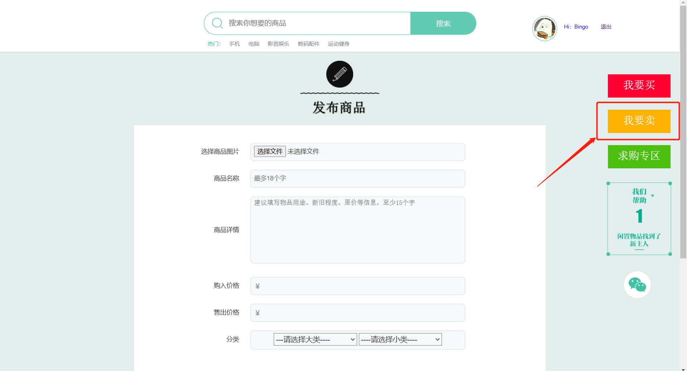
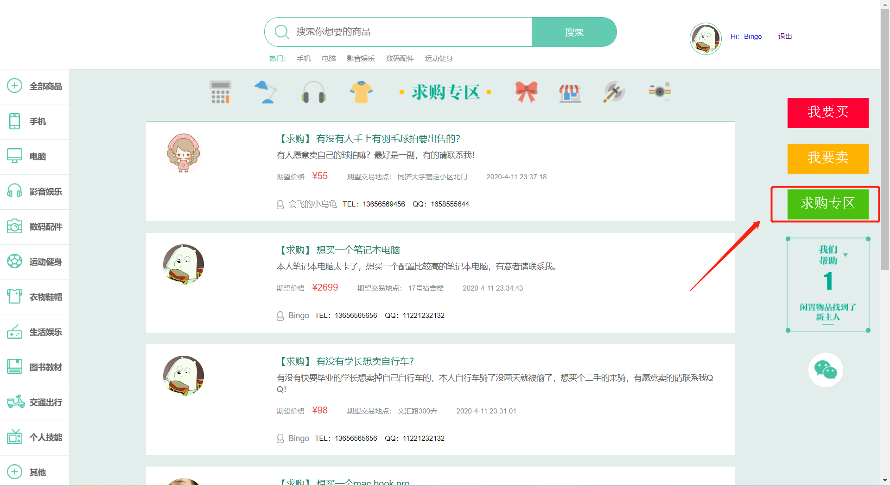

+# 校园二手市场带万字项目文档

## 一、介绍

基于springboot的校园二手交易平台带万字文档

开发语言：java

运行环境:idea或eclipse 数据库:mysql

## 二、项目功能介绍

### 1、后台功能介绍
1、菜单管理  2、角色管理
3、用户管理 4、日志管理
5、数据备份 6、分类管理
7、物品管理 8、求购物品
9、用户管理 10、评论管理
11、举报管理 12、公告管理
13、网站设置 14、搜索功能

### 2、前台功能介绍
1、用户注册 2、用户注册 3、个人资料编辑 4、发布商品（卖） 5、购买商品（买） 6、求购专区 7、发表评论 8、搜索商品

### 完整项目获取

通过网盘分享的文件：校园二手系统

链接: https://pan.baidu.com/s/1esEwif5uuiLchDVSndDSuA?pwd=af7t 提取码: af7t
--来自百度网盘超级会员v3的分享

通过网盘分享的文件：工具包

链接: https://pan.baidu.com/s/1YmdoJvkjoUjA75wvHLDZ6A?pwd=xm96 提取码: xm96
--来自百度网盘超级会员v3的分享

通过网盘分享的文件：远程调试部署联系方式

链接: https://pan.baidu.com/s/1W0dDcoZmayG0c7USJDYBYg?pwd=nqd7 提取码: nqd7
--来自百度网盘超级会员v3的分享

### 项目合集(项目不断更新中)
链接: https://pan.baidu.com/s/1nY-zhvAK0CXYcn3g7LzQnQ?pwd=id3c 提取码: id3c
--来自百度网盘超级会员v3的分享

#### 这些项目一起发你了 可以分享给你需要的同学 调试可找我 也接二次修改和项目定制、毕业设计等

## 接毕业设计和论文

微信联系方式：xzxj0206  QQ：3808981644   (支持修改、 部署调试、 支持代做毕设)

接网站建设、小程序、H5、APP、各种系统等，单片机、嵌入式也可以做

选题+开题报告+任务书+程序定制+安装调试+论文+答辩ppt  都可以做

## 三、后台部分页面展示

## 四、前台部分页面展示

